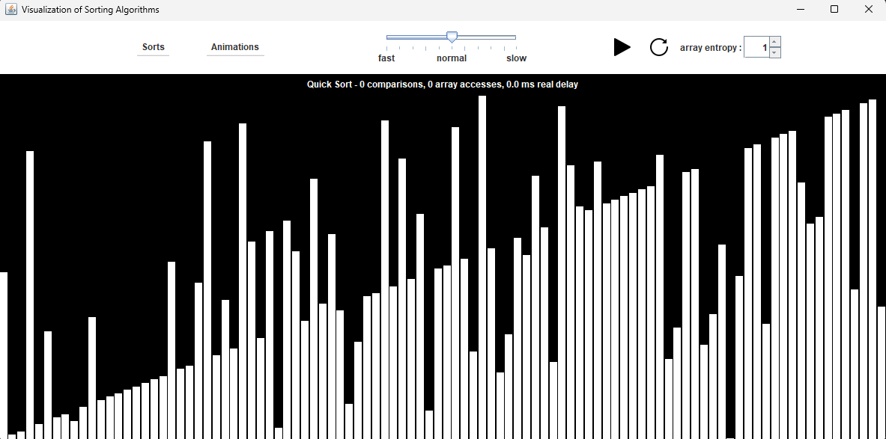
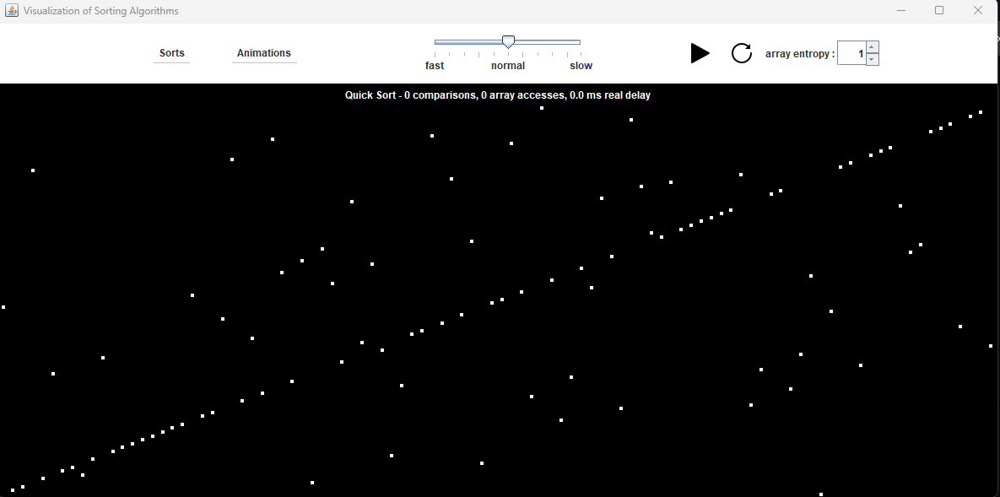
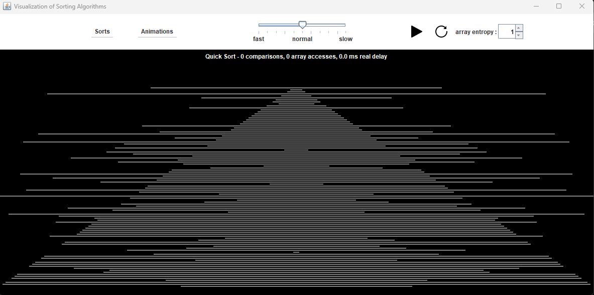
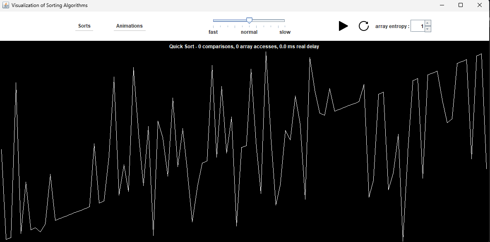

# Sujet AS : Analyse des algorithmes de tri

## Description

C'est un projet d'université fait en collaboration avec [Tom David](https://github.com/kitoutou999) et Emilien Huron.

## Fonctionalités

+ Implémentation d'un générateur de données non triées permettant de spécifier un niveau de désordre (quantité et répartition).

+ Implémentation de 18 algorithmes de tri au comportement a priori bien différent.

+ Implémentation d'une interface de visualisation générique de l'exécution de ces algorithmes.

## Comment lancer l'application

+ ANT : Ouvrir le terminal à la racine du projet et lancez la commande `ant run`.

+ WINDOWS : Ouvrir le terminal dans le dossier `dist/` et lancez l'exécutable `run.bat`.

+ LINUX : Ouvrir le terminal dans le dossier `dist/` et lancez l'exécutable `run.sh`.

## Autres commandes ant

+ Générer une nouvelle javadoc avec `ant javadoc`.

+ Explorer le fichier `build.xml` pour plus d'informations.

## Contribuer

+ N'hésitez pas à signaler des bugs.

+ N'hésitez pas à améliorer le code existant.

## Licence

Ce projet est sous licence [MIT](./LICENSE.md)

## Captures d'écran

## Crédits des images

Icones conçu par [www.freepik.com](https://fr.freepik.com/)

## Auteurs

[Tom David](https://github.com/kitoutou999), Emilien Huron et [Florian Pépin](https://github.com/florianppn).
